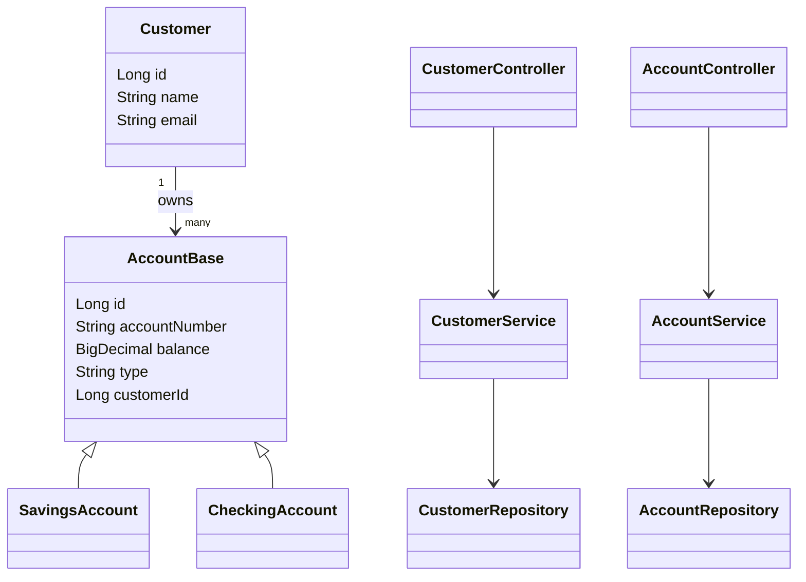

# Bank System REST API

## Project Description
This project is a Spring Boot REST API for a simple Bank System.
It demonstrates Object-Oriented Programming, SOLID principles,
design patterns, and JDBC database interaction.

The system allows managing customers and their bank accounts.

## Architecture
The project follows a layered architecture:
Controller → Service → Repository → Database

## OOP Principles
Encapsulation  
Inheritance  
Polymorphism  
Abstraction  
Composition

## SOLID Principles
Single Responsibility Principle  
Open / Closed Principle  
Liskov Substitution Principle  
Interface Segregation Principle  
Dependency Inversion Principle

## Design Patterns
Singleton  
Factory  
Builder
## Database Schema

### customers
- id (Primary Key)
- name
- email (Unique)

### accounts
- id (Primary Key)
- account_number (Unique)
- type
- balance
- customer_id (Foreign Key)

Relationship:
One Customer → Many Accounts

## Database
PostgreSQL is used as the database.
pgAdmin is used for database management.
The system contains two main tables:
customers and accounts.
There is a one-to-many relationship between customers and accounts.


## REST API Endpoints

Customers:
POST /api/customers  
GET /api/customers  
GET /api/customers/{id}  
DELETE /api/customers/{id}

Accounts:
POST /api/accounts  
GET /api/accounts  
GET /api/accounts/{id}  
GET /api/accounts/by-customer/{customerId}  
PUT /api/accounts/{id}/balance  
DELETE /api/accounts/{id}

## Example Request Body

### Create Customer
{
"name": "Batyrkhan",
"email": "batyrhan@gmail.com"
}

### Create Account
{
"accountNumber": "SA-001",
"type": "SAVINGS",
"balance": 1000,
"customerId": 1
}

## Global Exception Handling
The project uses @RestControllerAdvice to handle validation errors,
database errors, and business logic exceptions in a centralized way.

## Error Response Example

If email already exists:

{
"timestamp": "2026-02-11T01:30:00",
"status": 409,
"error": "Conflict",
"message": "Email already exists"
}

## UML Diagram
The system contains Customer and Account entities.
AccountBase is an abstract class.
SavingsAccount and CheckingAccount extend AccountBase.
One Customer can have multiple Accounts.



## Project Structure

endtermproject
│
├── pom.xml
├── README.md
├── screenshots
│   ├── create-account.png
│   ├── update-balance.png
│   ├── get-all-accounts.png
│   └── delete-account.png
│
└── src
└── main
├── java
│   └── com.batyrhan.bankapi
│       ├── Application.java
│       ├── controller
│       │   ├── CustomerController.java
│       │   └── AccountController.java
│       ├── service
│       │   ├── CustomerService.java
│       │   └── AccountService.java
│       ├── repository
│       │   ├── CustomerRepository.java
│       │   └── AccountRepository.java
│       ├── dto
│       └── exception
│
└── resources
├── application.properties
└── schema.sql

```
## How to Run
1. Create PostgreSQL database named bank_db
2. Configure application.properties
3. Run the project using Maven:
   mvn spring-boot:run

## Application Configuration

spring.datasource.url=jdbc:postgresql://localhost:5433/endtermoop
spring.datasource.username=postgres
spring.datasource.password=4865
spring.jpa.hibernate.ddl-auto=update

## Technologies
Java  
Spring Boot  
JDBC  
PostgreSQL  
Maven

## API Testing (Postman)

### Create Account (POST)


### Update Account Balance (PUT)


### Get All Accounts (GET)


### Delete Account (DELETE)


## Author
Batyrkhan Bakhadir